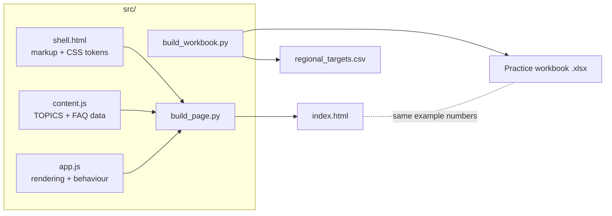
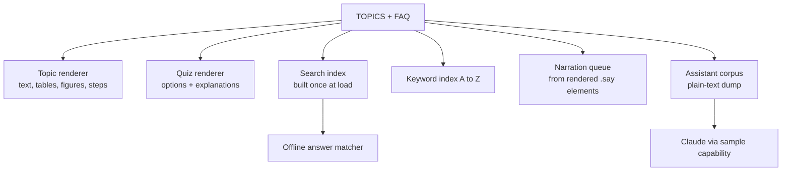
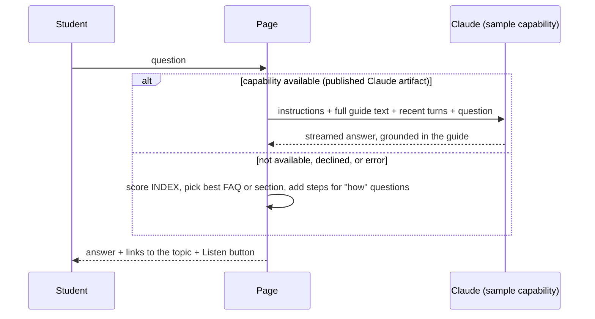

# Architecture

## Overview

The project has two deliverables built from one set of worked examples:

1. **The guide** (`index.html`): a single self-contained web page with no server and no build tooling beyond a 10-line assembly script.
2. **The practice workbook** (`Advanced_Excel_Practice_Workbook.xlsx`): generated by a Python script so that it can be rebuilt and verified.

The two are linked by convention, not by code: every number shown in a guide figure is a value the workbook calculates. The guide's content file is the single place those numbers are written for the page; the workbook script is the single place they are produced for Excel.

## The guide page

### Layers

| Layer | File | Responsibility |
|---|---|---|
| Structure and style | `src/shell.html` | Top bar, topic rail, empty page container, all CSS. Colours are defined once as tokens with light and dark values. |
| Content | `src/content.js` | Two constants: `TOPICS` (15 topics) and `FAQ` (23 entries). Pure data, no logic. |
| Behaviour | `src/app.js` | One IIFE. Renders views from the data, and runs search, quiz, audio and the assistant. |

Keeping content as data is the main design decision. Every feature reads the same `TOPICS` array:

Adding or correcting a topic therefore updates the page, the search results, the keyword index, the narration and the assistant's knowledge at once.

### Views and navigation

There is one page container (`#page`) and a `show(view, opts)` function that replaces its contents. Views are `home`, `t1` to `t15`, `index`, `ask` and `search`. The URL hash carries the view name (`#t6`), so topics can be linked directly. All clicks are handled by one delegated listener on `document`, driven by `data-*` attributes (`data-go`, `data-kw`, `data-ask`, `data-speak`, `data-faq`).

### Figures

Figures are generated, not stored as image files. Each figure is a small data object in `content.js` and a renderer in `app.js`:

| Type | Renders | Used for |
|---|---|---|
| `grid` | HTML table styled as a worksheet with a formula bar | Most examples |
| `bars`, `combo` | SVG chart drawn to scale | Charting topic |
| `region` | SVG feasible region | Linear Solver |
| `curve` | SVG profit curve computed from the model's formula | Nonlinear Solver |
| `trace` | SVG cells with precedent arrows | Formula auditing |
| `dialog` | HTML mock of an Excel dialog box | PivotTable fields, Sort, Goal Seek, etc. |
| `path` | Ribbon path chips | Menu locations |
| `tabs` | Sheet cards with a total | 3-D references |

Because figures are drawn from tokens, they follow light and dark themes and stay sharp at any size.

### Search

At load, `app.js` flattens the content into an `INDEX` array: one entry per topic, per section, per quiz question and per FAQ item. A query is tokenised, stop words are dropped, and each entry is scored (keyword or heading match 4, title 3, body 1). Results require every token to match; if nothing does, it falls back to any-token matching.

### Audio

Narration uses the browser's Web Speech API (`speechSynthesis`). The queue is built from elements marked with the class `say`, in page order. Tables and code blocks supply a short spoken summary through a `data-say` attribute instead of being read cell by cell. Text is split into chunks of about 220 characters because some browsers cut off long utterances. A token counter invalidates callbacks from a cancelled run. If the API is missing, the player is replaced by a note.

### Assistant (Ask & FAQ)

Two answer paths share one interface:

- **Grounding:** the prompt contains the whole guide as plain text (the corpus) and instructs the model to answer only from it and to name the topic.
- **Stateless calls:** each call is independent, so the last few turns are included in the prompt.
- **Graceful fallback:** outside a Claude artifact (for example on GitHub Pages) `window.claude` does not exist, so the page uses the offline matcher. Questions that match less than 60% of their terms get a "not covered" reply rather than a weak guess.

### State

| State | Where | Lifetime |
|---|---|---|
| Quiz answers, speech rate, voice | `localStorage` key `xlguide` | Per browser; optional, wrapped in try/catch |
| Current view | URL hash + `view` variable | Page session |
| Chat history | `chat` array in memory | Until reload |

Nothing is sent to a server except the assistant prompt when the Claude capability is in use.

## Installable web app

Served from GitHub Pages, the same `index.html` is a progressive web app:

| Piece | Role |
|---|---|
| `manifest.webmanifest` | Name, colours, icons and standalone display mode, so phones offer Add to Home Screen |
| `icons/` | 192px and 512px icons, a maskable icon for Android and an Apple touch icon, generated from one drawing |
| `sw.js` | Service worker. Pre-caches the page, manifest, icons, workbook and CSV. Page loads are network-first with a cached fallback; other files are cache-first and refreshed in the background. Google Fonts are cached after first use |
| Head tags in `build_page.py` | Manifest link, theme colour and Apple web-app tags |

`app.js` sets `STANDALONE` when the page is served over http(s) outside a Claude artifact. Only then does it register the service worker and show the workbook download links and install hint. Inside a Claude artifact those are skipped, because downloads and service workers are not available there.

Updating: old caches are deleted when `VERSION` in `sw.js` changes, so increase it with every release.

## The practice workbook

`src/build_workbook.py` uses `openpyxl` to write 20 sheets: a Start Here index, a shared Data sheet (an Excel Table named `SalesData`), one sheet per topic, and Jan/Feb/Mar sheets for 3-D references.

Principles:

- **Formulas, not pasted values.** Summaries read from the Data sheet, so changing an order flows through charts, lookups and answer checks.
- **Cell roles are colour coded.** Blue on pale yellow is an input; black is a formula; green text is a cross-sheet link; bright yellow is a part the student builds; pale green is an answer check.
- **Features that only Excel can create are exercises.** PivotTables, data tables, scenarios, Solver runs and macros are left for the student, each with a formula-based answer check beside it.
- **Compatibility.** Only functions available in Excel 2007 and later are used in live cells. Newer functions (XLOOKUP, FILTER, SORT, UNIQUE) appear as text for the student to type.

## Constraints and trade-offs

| Decision | Reason | Cost |
|---|---|---|
| Single HTML file, no framework | Opens anywhere, publishes as one artifact, nothing to install | `app.js` re-renders a whole view on each change |
| Content as JS data | One source for six features | Content authors edit a JS file, not a document |
| Generated figures | Theme-aware, exact, small | Not real Excel screenshots |
| Browser speech synthesis | No audio files, works offline | Voice quality depends on the device |
| Whole corpus in each prompt | Simple and always complete (about 56 KB) | Would not scale to a much larger course without retrieval |
| `.xlsx`, not `.xlsm` | Opens without macro warnings | Student saves a macro-enabled copy for Topic 15 |
